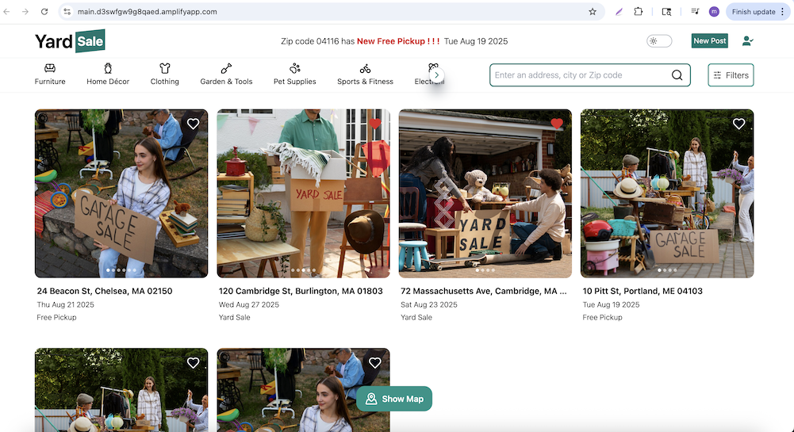
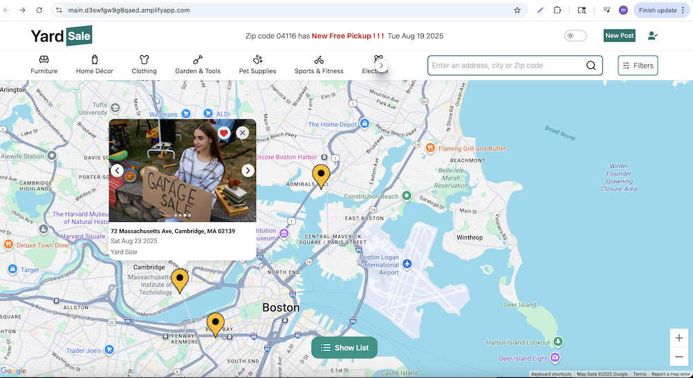

# Yard Sale Project

### Deployed backend on AWS EC2 and frontend on Amplify, the website is: 
```bash 
https://main.d3swfgw9g8qaed.amplifyapp.com 
```

### the deployment process follows EdRoh video on youtube:
```bash 
https://www.youtube.com/watch?v=X1zCAPLvMtw&list=LL&index=23&t=43659s
```
### EC2 setup code is on: (sudo su - for root access)
``` bash
https://github.com/ed-roh/real-estate-prod/blob/master/server/aws-ec2-instructions.md
```




## Frontend (client)
- **React** for building the user interface  
- **Zustand** lightweight state management for global data  
- **Tailwind CSS** for styling  
- **Google Maps API** for map integration  

## Backend (server)
- **Node.js** with **Express** framework  
- **MongoDB** as the database  
- **AWS S3** for images storage  


