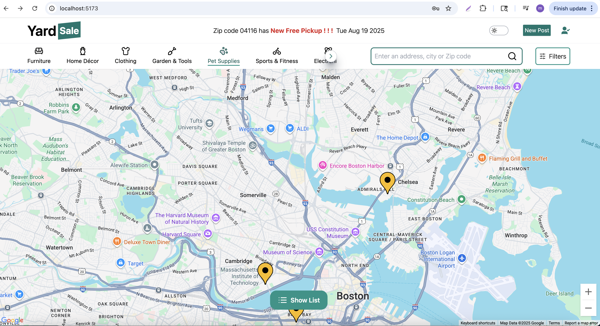

# Yard Sale Project

### Deployed backend on AWS EC2 and frontend on Amplify, the website is: 
```bash npm install npm run dev ```




## Frontend (client)
- **React** for building the user interface  
- **Tailwind CSS** for styling  
- **Lucide Icons** for iconography  
- **Google Maps API** for map integration  

## Backend (server)
- **Node.js** with **Express** framework  
- **MongoDB** as the database  
- **AWS S3** for images storage  


